# Live Render Reconciliation

Base: https://myfamilylawgroup.com
Asset key: mflg-live-20260623-172421-visible-lead-magnet

## 01-homepage-first-viewport

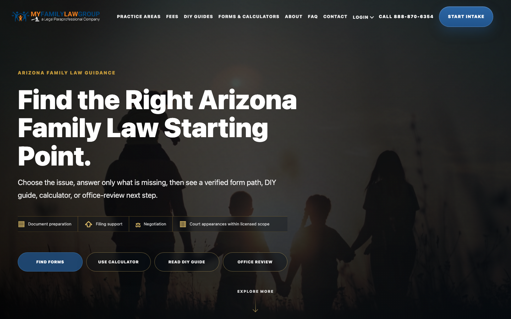

- route: /
- root children: 5
- old shell visible in first viewport: false
- new hero visible: true
- lead magnet entry present: true
- practice cards: 50
- guide cards: 0
- visible prerequisite panels: 0
- visible View form controls: 1

## 02-homepage-after-hero

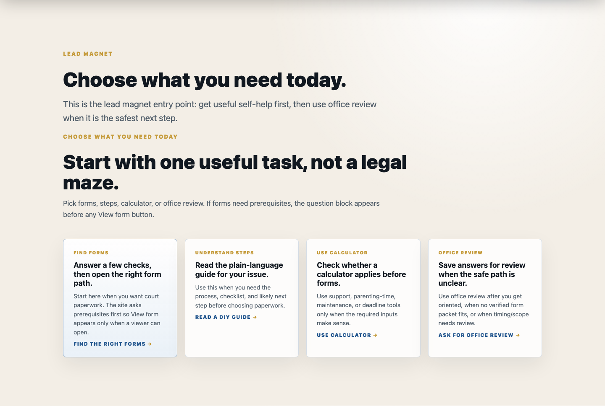

- route: /
- root children: 5
- old shell visible in first viewport: false
- new hero visible: true
- lead magnet entry present: true
- practice cards: 50
- guide cards: 0
- visible prerequisite panels: 0
- visible View form controls: 1

## 03-practice-areas-first-viewport

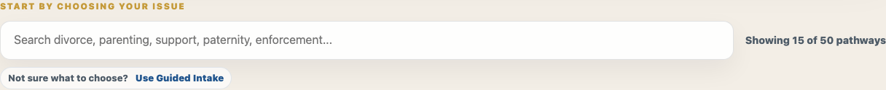

- route: /practice-areas/
- root children: 1
- old shell visible in first viewport: false
- new hero visible: false
- lead magnet entry present: false
- practice cards: 50
- guide cards: 0
- visible prerequisite panels: 0
- visible View form controls: 0

## 04-practice-card-before-click

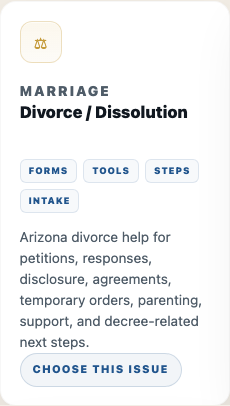

- route: /practice-areas/
- root children: 1
- old shell visible in first viewport: false
- new hero visible: false
- lead magnet entry present: false
- practice cards: 50
- guide cards: 0
- visible prerequisite panels: 0
- visible View form controls: 0

## 05-practice-card-after-click

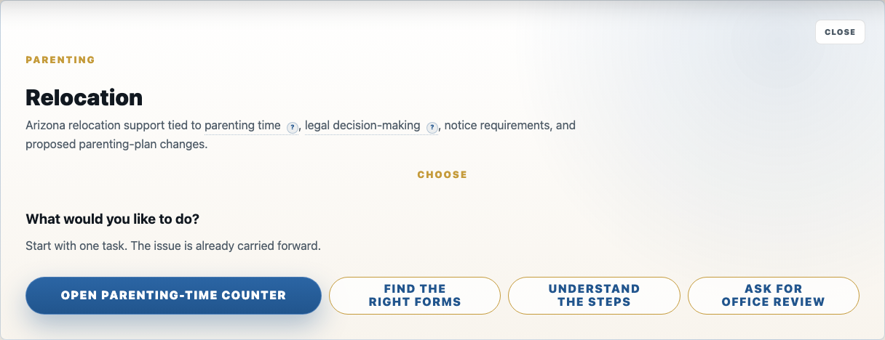

- route: /practice-areas/
- root children: 1
- old shell visible in first viewport: false
- new hero visible: false
- lead magnet entry present: false
- practice cards: 50
- guide cards: 0
- visible prerequisite panels: 0
- visible View form controls: 0

## 05b-practice-forms-prereqs

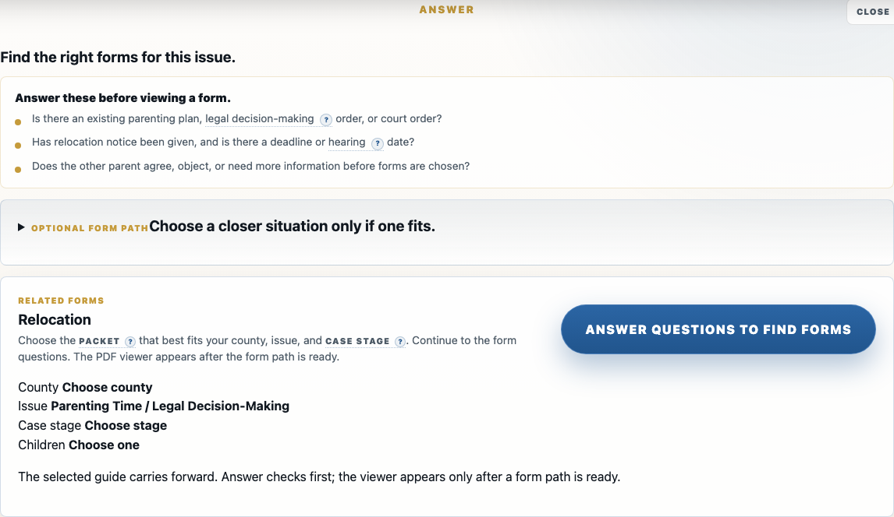

- route: /practice-areas/
- root children: 1
- old shell visible in first viewport: false
- new hero visible: false
- lead magnet entry present: false
- practice cards: 50
- guide cards: 0
- visible prerequisite panels: 1
- visible View form controls: 0

## 06-forms-direct-first-viewport

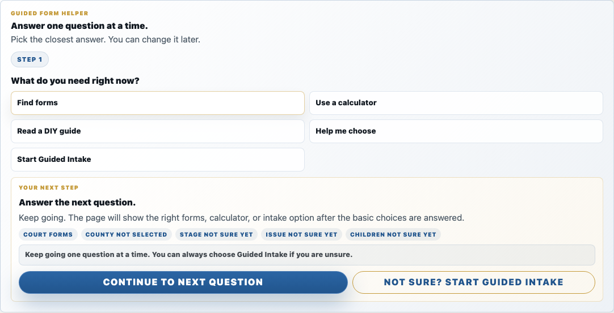

- route: /forms/
- root children: 1
- old shell visible in first viewport: false
- new hero visible: false
- lead magnet entry present: false
- practice cards: 0
- guide cards: 0
- visible prerequisite panels: 0
- visible View form controls: 0

## 07-forms-after-first-answer

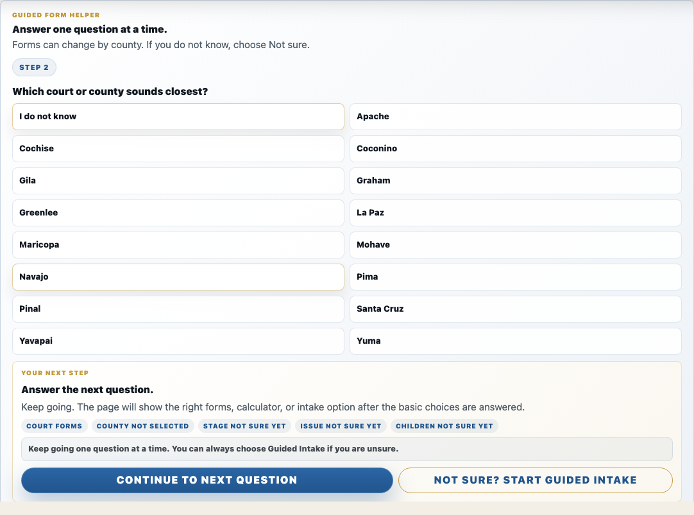

- route: /forms/
- root children: 1
- old shell visible in first viewport: false
- new hero visible: false
- lead magnet entry present: false
- practice cards: 0
- guide cards: 0
- visible prerequisite panels: 0
- visible View form controls: 0

## 08-forms-result-state

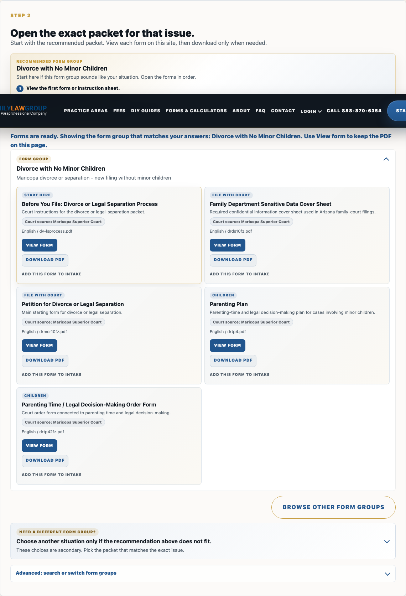

- route: /forms/
- root children: 1
- old shell visible in first viewport: false
- new hero visible: false
- lead magnet entry present: false
- practice cards: 0
- guide cards: 0
- visible prerequisite panels: 0
- visible View form controls: 5

## 09-onsite-form-viewer

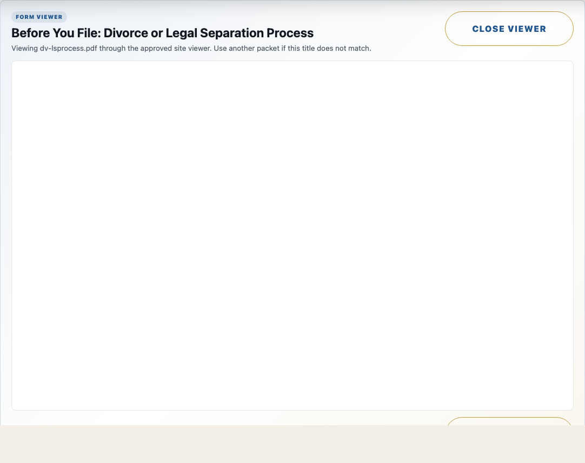

- route: /forms/
- root children: 1
- old shell visible in first viewport: false
- new hero visible: false
- lead magnet entry present: false
- practice cards: 0
- guide cards: 0
- visible prerequisite panels: 0
- visible View form controls: 5

## 10-diy-guides-first-viewport

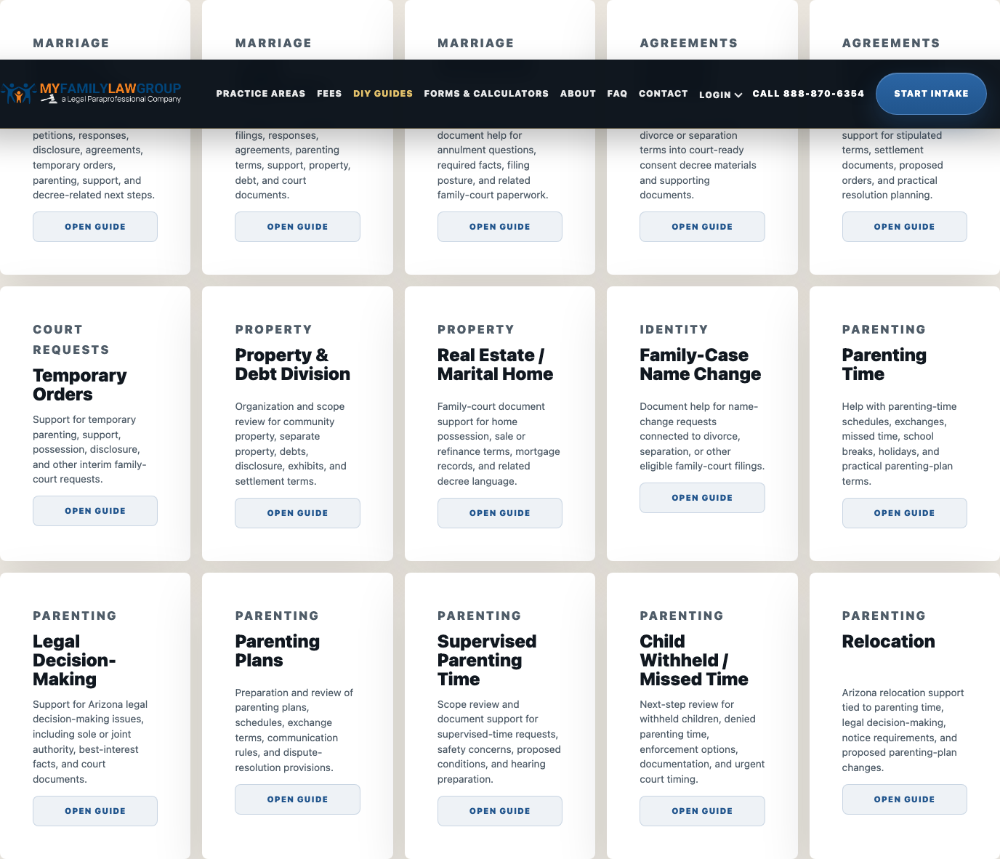

- route: /guides/
- root children: 1
- old shell visible in first viewport: false
- new hero visible: false
- lead magnet entry present: false
- practice cards: 0
- guide cards: 50
- visible prerequisite panels: 0
- visible View form controls: 0

## 11-contact-first-viewport

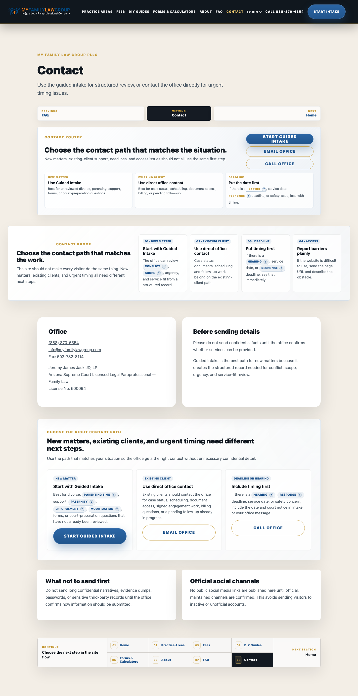

- route: /contact/
- root children: 1
- old shell visible in first viewport: false
- new hero visible: false
- lead magnet entry present: false
- practice cards: 0
- guide cards: 0
- visible prerequisite panels: 0
- visible View form controls: 0

## 12-fees-first-viewport

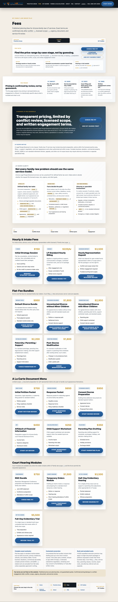

- route: /fees/
- root children: 1
- old shell visible in first viewport: false
- new hero visible: false
- lead magnet entry present: false
- practice cards: 0
- guide cards: 0
- visible prerequisite panels: 0
- visible View form controls: 0

## 13-start-first-viewport

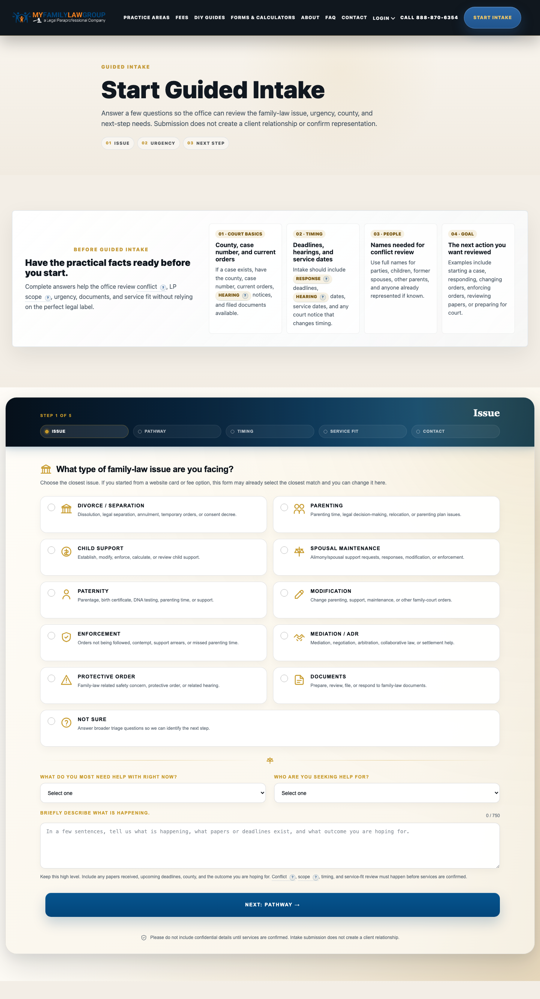

- route: /start/
- root children: 3
- old shell visible in first viewport: false
- new hero visible: false
- lead magnet entry present: false
- practice cards: 0
- guide cards: 0
- visible prerequisite panels: 0
- visible View form controls: 0

## 14-mobile-homepage

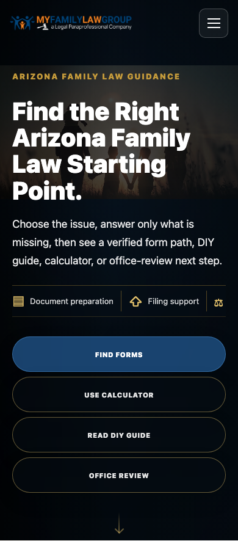

- route: /
- root children: 5
- old shell visible in first viewport: false
- new hero visible: true
- lead magnet entry present: true
- practice cards: 50
- guide cards: 0
- visible prerequisite panels: 0
- visible View form controls: 1
